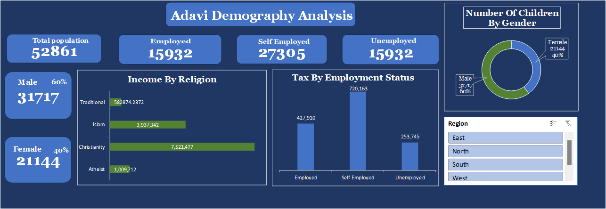

# ADAVI CITY DEMOGRAPHY ANALYSIS

I created an interactive dashboard tailored for the in-depth analysis of demographic data pertaining to Adavi City. 

This dashboard offers comprehensive insights into key areas such as population metrics, employment trends, gender distribution, income stratified by religious affiliation, taxation based on employment status, and the number of children categorized by gender. 

It was designed to be intuitive, ensuring that stakeholders can seamlessly navigate the data and derive meaningful conclusions with ease.

