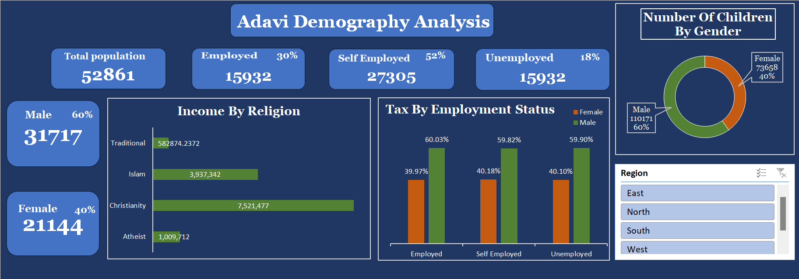

# **ADAVI CITY DEMOGRAPHY ANALYSIS**

This project is an interactive dashboard to analyze Adavi City's demographics, providing insights into population, employment, gender distribution, income by religion, tax by employment status, and the number of children by gender. 

It was designed to be user-friendly, enabling stakeholders to navigate the data effortlessly and draw meaningful insights with ease.

## **Purpose and Strategy**

The dashboard shows an overview of the total population, providing a summary of the city's population size. The population size is 52861.

**Gender Breakdown**

The gender breakdown shows the distribution of male to female in Adavi city. From the analysis, there are more male population of 31717(60%) and the female population is 21144(40%).

**Employment Distribution**

The employment distribution is shown to illustrate the shares of employed, unemployed, and self-employed people. This section offers a clear picture of Adavi's economy.

## **Detailed Insights**

•	**Income by Religion:**

A bar chart was used to illustrate the income by religion visually which shows income differences across religious groups, helping stakeholders identify economic disparities and compare average income levels for each group.

•	**Tax by Employment Status:** 

The tax breakdown by employment status shows that men contribute more in taxes across employed, unemployed, and self-employed categories compared to women. This suggests that men have higher representation or income in these groups.

 The gender disparity offers insights into economic participation and financial burden, helping stakeholders make decisions on tax policies, employment programs, and initiatives aimed at addressing gender inequality.
 
  It also aids in forecasting tax revenue and improving gender balance in economic participation.

•	**Number of Children by gender:** 

Pie chart was used to explain the number of children of children by gender. The number of children by gender shows the distribution of boys and girls, helping stakeholders understand gender balance and demographic trends for planning resources or services.

## **Interactive Slicer**
I added a slicer for the region to enable users filter data by the different regions in the city providing more insights of the demographic information.

**Data Presentation Techniques**

The creation of this dashboard involved a good understanding of Excel, data cleaning, Pivot Table, Charts, Text box, and Slicer, allowing for efficient data organization and visualization, which in turn enhanced the analysis and presentation of insights.

**Recommendation**

Regularly updating the analysis to reflect changing demographics and engaging stakeholders in the interpretation of results will ensure that insights remain relevant and actionable for decision-making.

