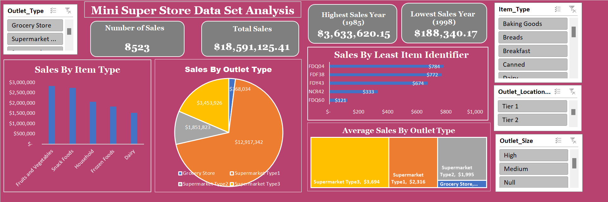

# Mini Superstore Project

In this project, I carried out a thorough analysis of the Mini Super Store data set to uncover important insights and display them using an interactive dashboard.

 The work involved transforming data, organizing it into categories, and creating visualizations to answer key business questions and provide a clear overview of the store's performance.

 
 

