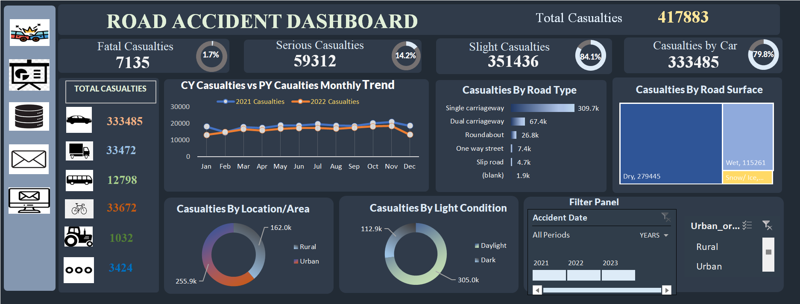

# Road Accident Analysis

The Road Accident Analysis dashboard is an interactive tool that examines the impact of casualties on the environment throughout the different years.

It visualizes monthly casualty trends, breaks down incidents by road type and location, categorizes casualties by type, and shows totals by vehicle type and road surface. 

These insights emphasize the importance of maintaining safe road traffic conditions.

 
 