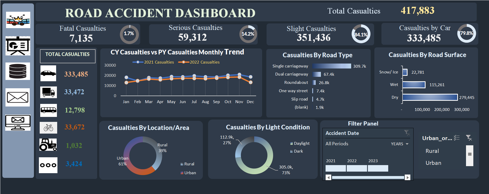

# **Road Accident Analysis**

This project features an interactive dashboard designed to analyze road accident data. It provides insights into total casualties and categorizes them into fatal, serious, and slight casualties.

The dashboard also compares monthly trends of casualties between the current year and the previous year (2021 vs. 2022) and breaks down casualties by location, light conditions, road types, and road surfaces. 

The analysis aims to identify patterns and trends in road safety, enabling stakeholders to make informed decisions and implement strategies to reduce accidents and improve overall road safety.

## **Purpose and Strategy**

The total casualties amount to 417,883, broken down by vehicle type, including cars, vans, buses, bicycles, tractors, and others. 

This analysis highlights the risks associated with each vehicle category, guiding strategies to enhance road safety, allocate resources efficiently, and target interventions to reduce accidents. 

Notably, car accidents accounted for the highest number of casualties, totaling 333,485.

•	**Current Year vs. Previous Year Casualties Monthly Trend**

The line chart displays monthly data comparing casualties between 2021 and 2022. Each year is represented by a different color, allowing users to easily observe monthly trends and compare casualties between the two years. 

The chart highlights which year had the most casualties, as well as the month with the highest number of casualties.

•	**Casualties By Road Type**

The bar chart provides a clear analysis of casualties across different road types, including single carriageway, dual carriageway, roundabout, one-way street, and slip road. 

The single carriageway recorded the highest number of casualties, highlighting the importance of road users understanding the specific road types they are on and taking precautions to avoid accidents.

•	**Casualties By Road Surface**

The road surface conditions is categorized as dry, wet, and snowy surfaces. The analysis shows that dry road conditions have the highest number of casualties. This may indicate that while dry roads are generally safer, overconfidence or higher speeds may contribute to more accidents. 

Understanding these patterns can help raise awareness among drivers and promote safer practices regardless of road conditions.

•	**Casualties by Location/Area**

The pie chart illustrates the distribution of casualties between rural and urban areas, with urban areas showing a significantly higher proportion of casualties. This suggests that densely populated regions with higher traffic volumes contribute to the elevated casualty numbers in urban settings. 

The visual highlights the need for enhanced safety measures and infrastructure improvements in urban environments to reduce accidents and ensure safer road conditions.

•	**Casualties by Light Condition**

The analysis reveals that daylight conditions account for a higher number of casualties compared to dark conditions. While daylight is typically associated with better visibility, the increased traffic volume and activity during the day may contribute to the higher casualty rate. 

This emphasizes the need for heightened awareness and caution, even during well-lit conditions.
	

**Slicers**

The dashboard includes slicers for accident year and area (rural and urban) to display different trends for each category across years. A strong understanding of Excel, data cleaning, charts, and pivot tables was crucial for creating these insights.

## **Recommendations**

To reduce road accidents, it is essential to prioritize targeted interventions based on the data trends. Increasing public awareness through driver education programs, particularly in urban areas where casualties are higher, and on dry roads where most accidents occur, is crucial. 

Additionally, improving infrastructure, such as better signage and road design, especially on single carriageways, could significantly lower casualty rates. 

Lastly, implementing stricter enforcement of traffic regulations during daylight hours, when most accidents happen, would help address the issue of overconfidence and reduce overall casualties.

 

 