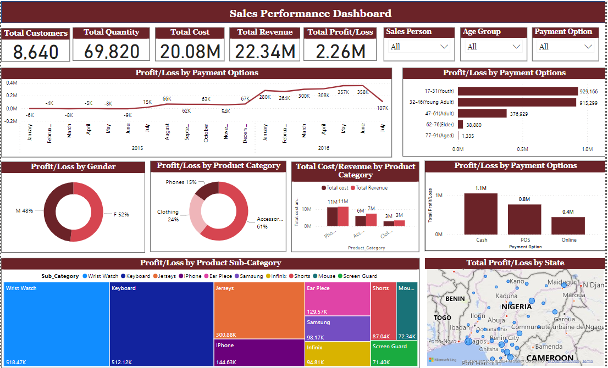

This project analyzes the sales performance of various product categories, including phones, clothing, and accessories. 

Using Power BI, the interactive dashboard visualizes key performance indicators (KPIs) such as total cost, total quantity, total revenue, and profit or loss. It also highlights product sub-categories by profit and shows customer payment preferences (cash, POS, and others). 

Additionally, demographic factors like age and gender are examined to understand their impact on sales across each category, providing insights into how different factors influence overall sales performance.

