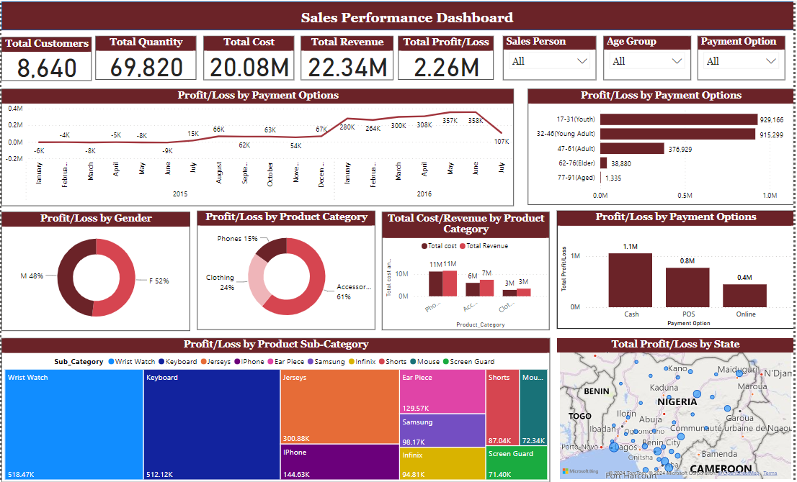

# **Sales Performance Dashboard**

The Sales Performance Dashboard using PowerBI provides an overview of key performance indicators (KPIs) that are important for assessing business success. It tracks total customers, offering insights into customer engagement and retention. 

The total quantity metric shows the volume of products sold, while total cost and total revenue figures enable a clear analysis of financial performance. Additionally, the dashboard calculates total profit, allowing stakeholders to quickly assess profitability. 

By combining these KPIs, the dashboard supports informed decision-making and strategic planning to improve overall sales effectiveness.

## **In-depth analysis**

**Trend of Profit/Loss**

The line graph analyzes profit and loss trends from 2015 to 2016, displaying yearly fluctuations and monthly calculations. This visualization helps stakeholders identify patterns and key factors influencing profitability, facilitating informed decision-making for future growth.

**Profit/Loss by Age Group**

The analysis of profit and loss by age group reveals distinct trends among different demographics. The age groups are categorized as follows: 17-31 (Youth), 32-46 (Young Adult), 47-61 (Adult), 62-76 (Elder), and 77-91 (Aged). Among these groups, the youth category generates the highest profits, closely followed by young adults. 

Adults also contribute significantly, while the elder and aged categories show lower profit margins. This breakdown highlights the varying financial impact of each age group, indicating potential opportunities for targeted marketing and engagement strategies to enhance profitability among different demographics.

Also, recognizing lower profitability in older age groups could lead to strategies designed to improve engagement or address the specific needs of these consumers, ultimately enhancing overall profitability across all demographics. 

**Profit/Loss by Gender**

The pie chart illustrates the profit and loss distribution by gender, showing females at 52% and males at 48%. This indicates a slight edge in female contributions to profitability, suggesting that businesses should consider targeting marketing strategies towards women and understanding their preferences. 

The close percentages emphasize the importance of engaging both genders to enhance overall financial performance.

**Profit/Loss by Product Category** 

The pie chart illustrates the distribution of profit and loss across different product categories. Accessories dominate with 61%, indicating a strong market preference, followed by clothing at 24%, and phones at 15%. 

This breakdown highlights the significant role that accessories play in overall profitability, suggesting that businesses should consider focusing on this category to maximize returns. 

Understanding these proportions can guide inventory decisions and marketing strategies to better cater to consumer interests.

**Total Cost/Revenue by Product Category**

These numbers indicate that phones generate the highest revenue, significantly surpassing their costs. Accessories also show a positive profit margin, while clothing, although profitable, has a smaller scale compared to the other categories.

This information is vital for businesses to assess product performance and make informed decisions about resource allocation and marketing strategies.

**Profit/Loss by Payment Options** 

The bar chart presents the profit and loss distribution by payment options. Cash leads with the highest profit at 1.1 million, followed by point of sale (POS) transactions at 0.8 million, and online payments at 0.4 million. 

This data highlights the importance of cash transactions in driving profitability, while also indicating that POS and online payment methods contribute significantly but to a lesser extent. 

Businesses may want to prioritize cash handling strategies and consider ways to enhance online payment options to improve overall financial performance.

**Profit/Loss by Product Sub-Category**

The treemap displays the profit and loss by product sub-category, highlighting a diverse range of items, including wristwatches, keyboards, jerseys, iPhones, earpieces, Samsung phones, Infinix phones, shorts, screen guards, and mice. 

Among these, wristwatches, keyboards, and jerseys stand out with the highest profit. This information helps identify the most profitable sub-categories and informs future inventory and marketing strategies.

**Total Profit/Loss by State**

The filled map of Nigeria illustrates total profit and loss by state, with bubble sizes indicating sales volume. Larger bubbles represent states with higher sales figures, providing a visual representation of where the business performs best.

This map not only highlights key areas of profitability but also helps identify regions that may require targeted marketing efforts or resource allocation to boost sales further.

By analyzing this geographical data, businesses can make informed decisions to optimize performance across different states.

## **Slicers**

The slicers in the dashboard display options for selecting salespersons, age groups, and payment methods. This functionality enables users to gain deeper insights into the sales data, allowing for tailored analysis based on specific criteria.

Proficiency in Power BI, along with skills in data cleaning and effective use of visualizations and filters, is essential for effectively conveying information to users.

## **Recommendations**

Understanding payment option data can improve customer transaction experiences. Regular reviews of performance by age group and gender will refine offerings, and training for sales personnel can boost customer engagement. 

Continuous monitoring and adaptation based on insights will support ongoing growth and profitability.

