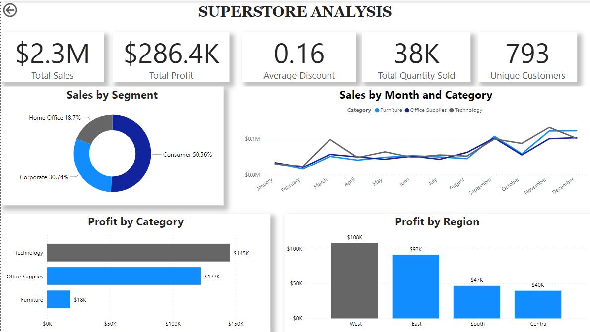

# Superstore Project

In this project, I analyzed the Superstore data set to extract valuable insights and present them in an interactive dashboard. 

The process included transforming the data, categorizing it, and creating visuals to address key business questions, giving a clear picture of the store's overall performance.

