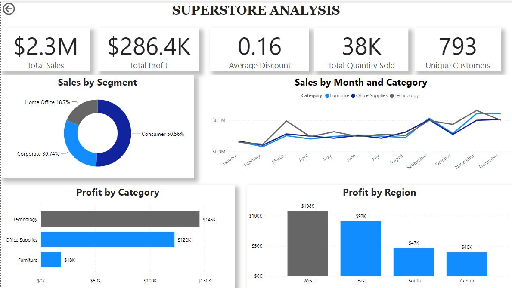

# **Superstore Project**

The Superstore analysis provides a sales dashboard with key performance metrics including total sales, total profit, average discount, total quantity sold, and customer IDs. Total sales reflect the overall revenue generated. Total profit represents the earnings after costs. 

Average discount refers to the typical reduction offered on products. Total quantity sold shows the number of items sold, while customer ID uniquely identifies each customer.

## **Visual Analysis**
•	**Sales by Segment**

Sales by segment refers to dividing sales into categories like consumers, corporate clients, or home offices. The pie chart illustrates the breakdown of sales across three segments: consumer sales (50.56%), corporate sales (30.74%), and home office sales (18.7%). 

Consumer sales dominate, making up over half of total sales, indicating a strong focus on individual customers.

Corporate and home office sales, while smaller, still represent significant portions of the overall market, offering potential for growth with targeted strategies. It helps identify which group generates the most revenue and highlights areas for growth or improvement.

•	**Sales by Month and Category**

This analysis presents the monthly sales trends across three distinct categories: furniture, office supplies, and technology. The line graph visualizes the sales performance of each category over time, revealing fluctuations and patterns in consumer behavior. 

By examining these trends, businesses can identify peak sales periods and make informed decisions about inventory management to optimize sales across all categories.

•	**Profit by Category**

This section analyzes the profit generated from three categories: technology, office supplies, and furniture. The bar chart shows that technology leads in profit, reflecting high demand and sales performance, followed closely by office supplies. Furniture ranks third in profitability. 

This analysis enables businesses to identify the most lucrative areas and tailor their strategies to maximize profits effectively.

•	**Profit by Region**

This section analyzes profit across four regions: North, East, West, and South. The West region leads in profitability, highlighting the need for businesses to assess performance in all areas. 

Understanding these regional differences helps allocate resources effectively and identify growth opportunities, supporting informed decision-making and strategic planning.

**Data Preparation Technique**

Proficiency in Power BI, data cleaning, and using visualizations is essential for clearly presenting information to users.

## **Recommendations**

Enhance customer engagement through personalized marketing and promotions to foster loyalty and repeat purchases. To improve business performance and sales, the focus should be on strategies that boost consumer demand, such as enhancing marketing for technology products and expanding corporate sales initiatives.

